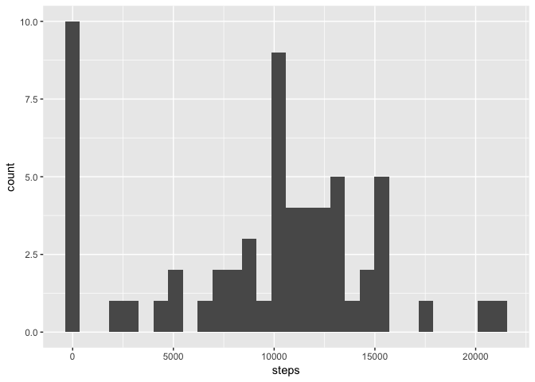
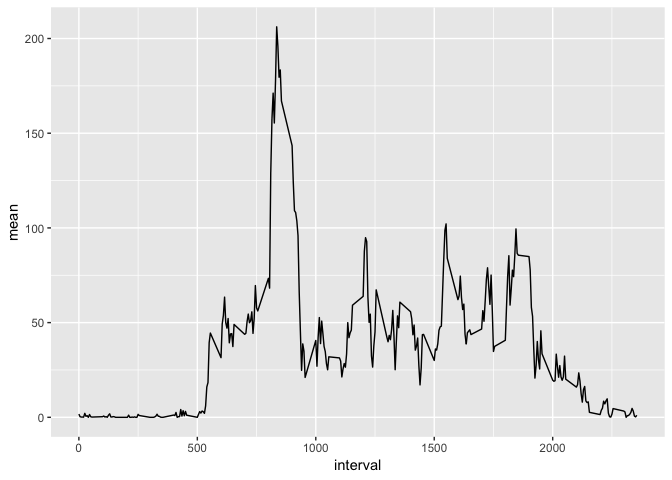
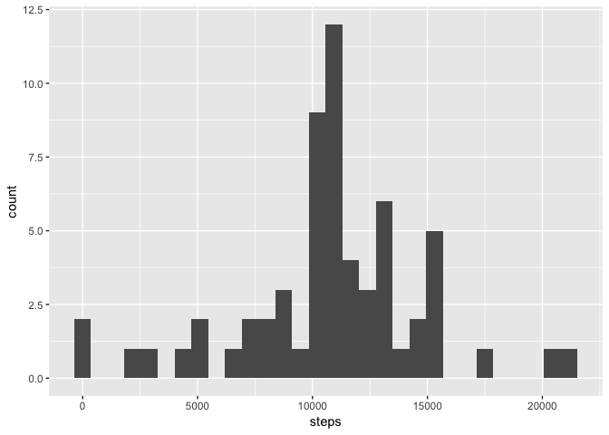
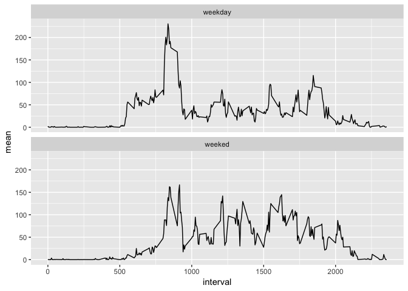

### Libraries

```r
library(dplyr, warn.conflicts = FALSE)
```

```
## Warning: package 'dplyr' was built under R version 3.5.2
```

```r
library(ggplot2)
```
##Loading and preprocessing the data
        For this project, the data was read into r with the read.csv function.  The date column was then formatted as a date, a column was added for day of the week (wday), and a weekend indicator column was added as well (wkend).  Below is an example of the processed data as well as the code used to process it.

```r
 steps_data<-read.csv("activity.csv")%>%
                dplyr::mutate(date = lubridate::ymd(date), 
                        wday = lubridate::wday(date, label = TRUE),
                        wkend = ifelse(wday == "Sat" | wday == "Sun",
                                       "weeked", "weekday"))
head(steps_data, 5)
```

```
##   steps       date interval wday   wkend
## 1    NA 2012-10-01        0  Mon weekday
## 2    NA 2012-10-01        5  Mon weekday
## 3    NA 2012-10-01       10  Mon weekday
## 4    NA 2012-10-01       15  Mon weekday
## 5    NA 2012-10-01       20  Mon weekday
```


## What is mean total number of steps taken per day?


```r
# Groups by date and sums number of steps taken per day
total_steps<-steps_data%>%
                dplyr::group_by(date)%>%
                dplyr::summarize(steps = sum(steps, na.rm = TRUE))
```


```r
# Mean and Median calculations.
raw_mean<-signif(mean(total_steps$steps, na.rm = TRUE),4)
raw_median<-median(total_steps$steps, na.rm = TRUE)
```
In order to calculate the mean and median steps per day, first the total number of steps per day had to be calculated.  To do this, the data was grouped by date and the steps were summed.  The mean/median calculations could then be made.  The mean total number of steps taken per day was 9354.  The median total number of steps taken per day was 10395.  For both of these calculations, NAs were removed from the calculation.  A histogram of total steps per day is included below as well.  One interesting observation was there were 10 days reporting 0 steps taken. 

```r
# Histogram of total steps per day
total_steps%>%
        ggplot2::ggplot(aes(steps))+
        ggplot2::geom_histogram()
```

```
## `stat_bin()` using `bins = 30`. Pick better value with `binwidth`.
```

<!-- -->

## What is the average daily activity pattern?


```r
# Groups data by interval and takes the mean
avg_Act<-steps_data%>%
        dplyr::group_by(interval)%>%
        dplyr::summarize(mean = mean(steps, na.rm = TRUE))

max_interval<-avg_Act%>%
                dplyr::filter(mean == max(mean))%>%
                dplyr::select(interval)
max_amount<-as.integer(max(avg_Act$mean))
```

To find the average daily activity, the data was grouped by interval and then the mean of the steps was taken.  Again, NAs were removed from the calculation.  A time series of the average daily activity pattern can be found below.  The interval with the highest average number of steps was 835.  This interval averaged 206 steps.  Generally, day time activity tends to remain between 25 and 100 steps on average. Additionally, activity levels were near zero during the night.

```r
# Creates time series plot
ggplot2::ggplot(data = avg_Act, aes(x = interval, y = mean))+
        ggplot2::geom_line()
```

<!-- -->

## Imputing missing values


```r
# Calculating total NAs 
na<-sum(is.na(steps_data$steps))
```
In this data set there were 2304 NAs. For imputing these missing values, the mean value for the given interval was used. Below is an example of the data after missing values are replaced with the interval means.


```r
# Imputing NAs with the mean for the given interval.
imputedData<-steps_data%>%
                dplyr::group_by(interval)%>%
                dplyr::mutate(interval_mean = mean(steps, na.rm = TRUE))%>%
                dplyr::ungroup()%>%
                dplyr::mutate(steps = ifelse(is.na(steps), interval_mean, steps))
                
head(imputedData, 5)
```

```
## # A tibble: 5 x 6
##    steps date       interval wday  wkend   interval_mean
##    <dbl> <date>        <int> <ord> <chr>           <dbl>
## 1 1.72   2012-10-01        0 Mon   weekday        1.72  
## 2 0.340  2012-10-01        5 Mon   weekday        0.340 
## 3 0.132  2012-10-01       10 Mon   weekday        0.132 
## 4 0.151  2012-10-01       15 Mon   weekday        0.151 
## 5 0.0755 2012-10-01       20 Mon   weekday        0.0755
```
After imputing the data with the interval means, the mean and median total steps per day were recalculated.

```r
# Recalculating total steps per day with imputed data.
imputed_steps<-imputedData%>%
                dplyr::group_by(date)%>%
                dplyr::summarize(steps = sum(steps, na.rm = TRUE))

imputed_mean<-as.integer(mean(imputed_steps$steps, na.rm = TRUE))
imputed_median<-as.integer(median(imputed_steps$steps, na.rm = TRUE))
```
  The new values were 10766 for the mean and 10766 for the median.  By comparison, the original values were 9354 for the mean and 10395 for the median.  Replacing the missing values in the data raised the mean and median values considerably.  Below find a histogram for the total steps for the imputed data

```r
# Histogram of total steps per day with imputed data
imputed_steps%>%
        ggplot2::ggplot(aes(steps))+
        ggplot2::geom_histogram()
```

```
## `stat_bin()` using `bins = 30`. Pick better value with `binwidth`.
```

<!-- -->

## Are there differences in activity patterns between weekdays and weekends?

In order to determine if there any differences in activity between weekdays and weekends, the data was grouped first by the wkend variable and then the interval variable.  The mean number of steps was then taken.  The data was then plotted faceted by the wkend variable.  While there is still a spike in the morning in the weekend plot, it is much less defined compared to the weekday pot.  Additionally, the weekend plot has a wider range of values throughout the day.


```r
imputedData%>%
        dplyr::group_by(wkend, interval)%>%
        summarize(mean = mean(steps))%>%
        ggplot(aes(x = interval, y = mean))+
        geom_line()+
        facet_wrap(~wkend, nrow = 2, ncol = 1)
```

<!-- -->
